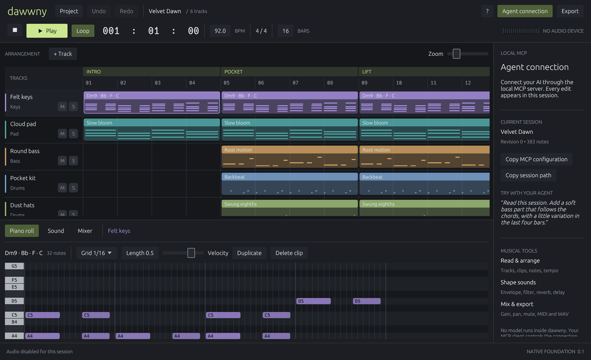

# dawwny

**A native music studio that your agents can play.**

[](https://github.com/coder-crypt0/dawwny/actions/workflows/ci.yml) [](LICENSE)

Compose in a native arrangement editor or connect your own AI through MCP. Both edit the same musical document. Rust synthesizers turn it into sound, with no Electron, Chromium, WebView, bundled model, cloud account, or sample-library download.

**v0.1 is a working native prototype for MIDI composition.** It is not yet a full replacement for Logic Pro or another production DAW. Native plugins, recording, audio tracks, automation, and remote access are on the roadmap.



## What works

| Studio | Agent control | Audio |
| --- | --- | --- |
| Arrangement and draggable MIDI clips | Local stdio MCP connector | Native device playback |
| Piano roll: add, move, delete notes | Read the project and revision | Keys, pad, bass, lead, drum synthesis |
| 2,310-sound library: 72 families × 32 variations + 6 signatures | Atomic musical command batches | Dawn dual-oscillator subtractive synthesis |
| Track mixer, mute, solo, pan | Stale-edit conflict protection | Sample-clock loop transport |
| Autosave, open, save copy, undo/redo | Automatic UI refresh after agent edits | Streaming 24-bit WAV export |
| MIDI import/export | MIDI and WAV export tools | No whole-song PCM buffer |

The included **Velvet Dawn** session is an original 16-bar arrangement with six tracks and 383 notes. Its JSON document is under [examples](examples/demo.dawwny.json).

## Run locally

Windows x64 is the currently verified platform. The native dependencies also target Linux/macOS, but those builds have not been validated yet.

Install Rust 1.88 or newer and your platform's native build tools. Windows requires Visual Studio C++ Build Tools and the Windows SDK.

```sh
cargo run -p dawwny-app
```

For optimized binaries, including the MCP connector:

```sh
cargo build --release --workspace --locked
```

Open `target/release/dawwny.exe` on Windows. Both the UI and MCP default to `sessions/untitled.dawwny.json` relative to their working directory. Select an explicit shared file when using agents:

```sh
dawwny --project /path/to/session.dawwny.json
dawwny-mcp --project /path/to/session.dawwny.json --export-dir /path/to/exports
```

Use **Agent connection → Copy MCP configuration** to get the correct executable and session paths for your client. The model runs in your chosen client; dawwny supplies musical tools. [MCP setup](docs/mcp.md).

## Make something

Press **Space** to play. Select a clip to open its piano roll. Double-click an empty lane to create a clip, then click in the piano roll to add notes. Drag clips and notes to move them; right-click a note for pitch, length, velocity, and delete controls. Toggle **Sounds** (or press **L**) to search and filter the library, favorite sounds, audition a separate preview, or use a sound on the selected track. See the [studio guide](docs/studio-guide.md) for project controls.

Edits save locally after a short debounce. A committed edit restarts active playback from the beginning; smooth live graph replacement and seeking are future transport work. MIDI import supports constant-tempo 4/4 note sequences, not another DAW's complete instrument/controller state.

[Studio guide](docs/studio-guide.md) · [Sound design](docs/sound-design.md) · [Project format](docs/project-format.md) · [Architecture](docs/architecture.md) · [Roadmap](docs/roadmap.md)

## Built to stay small

The UI draws natively through egui/Glow. CPAL owns audio output. The engine compiles notes into event metadata and streams samples through a fixed 128-voice pool, with bounded delay/reverb buffers. The UI repaints on interaction, at about 30 Hz during playback, and polls for agent edits when idle. The separate MCP executable only runs when a client starts it.

Release binaries are single-digit MiB. A dedicated test counts allocations and frees inside the sample loop and requires zero. Exact measured baselines and their limits are documented as part of each release; development caches are separate from the distributed app.

## Workspace and verification

```text
crates/
  core/    Project types, validation, transactions, persistence, MIDI
  audio/   Streaming DSP, device playback, WAV rendering
  app/     Native arrangement, piano roll, sound editor, mixer
  mcp/     Local agent tools and protocol integration tests
docs/      Design decisions, guides, roadmap, measurements
examples/  Original editable demo session
```

```sh
cargo fmt --all -- --check
cargo test --workspace --locked
cargo clippy --workspace --all-targets --locked -- -D warnings
cargo run --release -p dawwny-audio --example render -- exports/velvet-dawn.wav
```

Tests cover validation, atomic edits, concurrent writers, MIDI round trips, audible DSP controls, bounded rendering memory, callback allocations, WAV data, GUI state/undo/conflicts, and a real MCP client/server exchange.

For a separate process check after building, run `python scripts/smoke-mcp.py`. Native UI captures use the optional `capture` feature and `DAWWNY_SCREENSHOT_PATH`; that feature is excluded from normal builds. The screenshots above use `--no-audio` for repeatable capture.

No hosting is configured. Future remote control will use Hostinger when that part of the project is implemented. Native VST3 support will require a separate crash-isolated plugin host; this build does not scan or load installed plugin binaries.

## License

[MIT](LICENSE). Third-party crates retain their own licenses.
