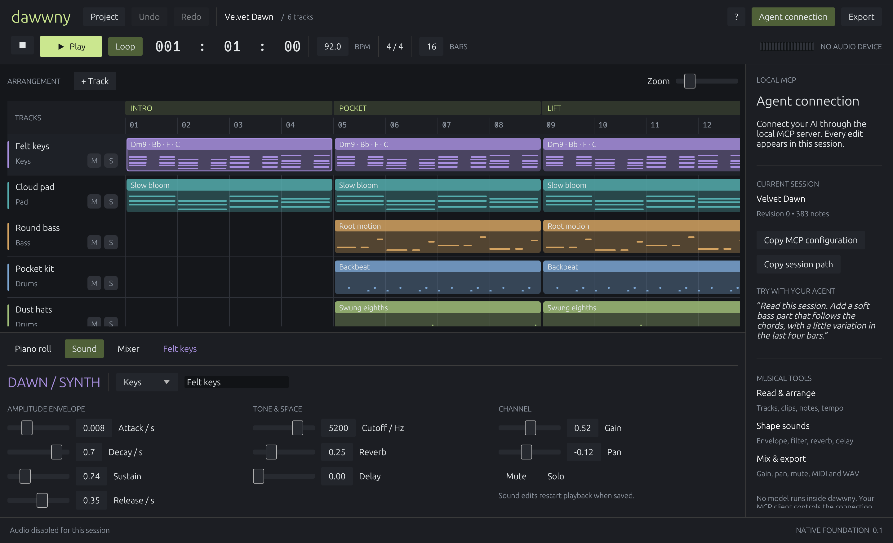

# Native studio guide

Run `cargo run -p dawwny-app`, or open the release `dawwny.exe`. A new session starts with the original **Velvet Dawn** arrangement: felt keys, soft pad, bass, drums, hats, and a small lead phrase. Nothing is downloaded or generated by an online service.

## Arrange and edit

- Press **Space** to play or stop. The loop button applies when playback starts.
- Click a clip to open its piano roll. Drag a clip to move it on the quantized grid.
- Double-click an empty track lane to create a one-bar clip. Add instruments with **+ Track**.
- Click empty piano-roll space to add a note. Set grid, note length, and velocity for new notes in the editor toolbar. Drag notes to change time and pitch. Right-click a note to open its properties, where you can edit pitch, length, and velocity or delete it.
- Use **Duplicate** to copy a clip immediately after its end. A copy that extends past the session end is rejected; lengthen the project first.
- Toggle **Sounds** in the top bar or press **L** to open the 2,310-entry sound library. Browse its 12 categories, search names/families/tags, favorite presets, select a result, then **Preview** it or **Use sound** on the selected track. The catalog is generated from 72 sound families with 32 parameter variations each, plus six signature presets; this count describes catalog recipes, not a claim that every patch was professionally auditioned. Preview uses a separate temporary playback engine and does not edit the project. Using a sound changes the selected track's instrument and patch while preserving its notes and mix; if there are no tracks, a synth track is created.
- **Sound** edits the selected track's instrument, name, synth, envelope, cutoff, reverb, delay, gain, and pan.
- **Mixer** provides track faders, mute/solo, pan, and a master fader.
- **Expand** gives the piano roll, sound designer, or mixer the full workspace; **Collapse** returns to the arrangement. Drag the editor's upper edge to resize the split view. **Fit** shows the entire arrangement horizontally.

Edits autosave after a short debounce. Undo/redo retain up to 32 edit groups in memory. The audio plan is immutable during a playback run: saving a sound or note edit restarts playback from the beginning. Continuous live graph replacement and seeking are later transport improvements.

## Files and export

The project-name menu provides **New session**, **Open project / MIDI**, **Save**, **Save a copy**, **Undo/Redo**, project length (in bars), the fixed 4/4 signature, **Open Velvet Dawn demo**, and this guide. Opening a JSON project switches the active session to that file; imported MIDI becomes a new local session and the original file is preserved. **Save a copy** lets you choose a destination.

**Export** writes either a 24-bit stereo WAV at 48 kHz, including effect tails, or a MIDI sequence. WAV export runs on a worker thread so editing stays responsive and audio isn't buffered for the entire song. A running export must finish before the window closes.

MIDI import is for notes and constant-tempo arrangement, not a full reconstruction of another DAW's instruments, controllers, or mixing. See [project format](project-format.md).

## Bring your own agent

Build both executables with `cargo build --release --workspace`. The **Agent connection** panel copies an MCP configuration using the actual executable and session paths. Add it to your MCP-capable client. Both the UI and client must reference the same project file. There is no bundled chatbot or hidden AI process.

Example agent request: “Read this session, add a soft bass line following the chords, vary the last four bars, and export a WAV.” The tool schema supplies the supported commands. The UI receives committed agent edits automatically. [MCP setup and tool details](mcp.md).

## Current boundaries

This is a MIDI composition prototype, not a full Logic Pro replacement. Native plugin hosting, sample/audio tracks, recording, hardware MIDI, automation lanes, tempo maps, plugin delay compensation, per-note expression, stems, and remote collaboration are future milestones. It has no network listener and no site deployment. Hostinger will be considered when remote access is implemented.
