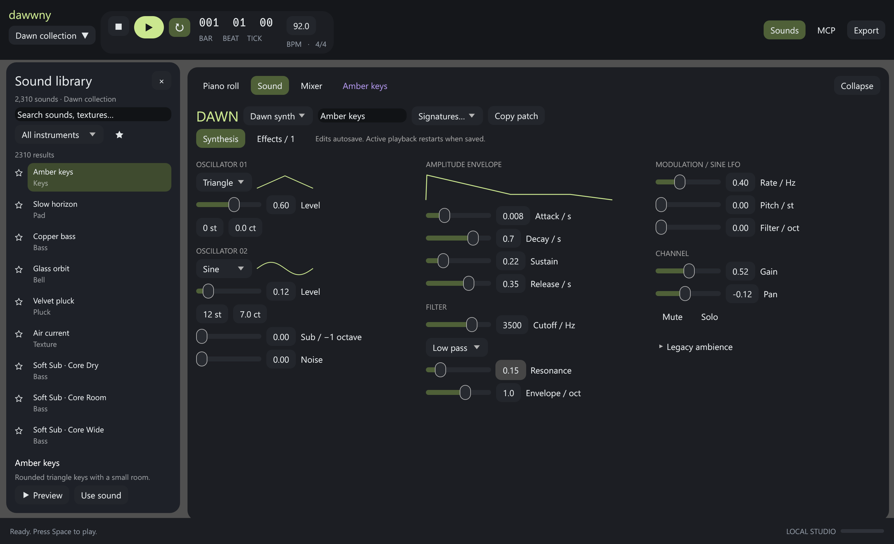

# Native studio guide

Run `cargo run -p dawwny-app`, or open the release `dawwny.exe`. A new session starts with the original **Velvet Dawn** arrangement: felt keys, soft pad, bass, drums, hats, and a small lead phrase. Nothing is downloaded or generated by an online service.

## Arrange and edit

- Press **Space** to play or pause at the current position. **Stop** returns to the beginning. Click or drag the numbered arrangement ruler to move the playhead. The loop button changes the running transport.
- Double-click a section above the ruler to highlight its bounds, seek to its start and cycle it. Running playback continues; paused playback stays paused. **C** or **↻** toggles cycle, retaining the chosen range. **Sections** edits section names, start bars and lengths; **Cycle whole song** clears the range.
- Click a clip to open its piano roll. Drag a clip to move it on the quantized grid.
- Double-click an empty track lane to create a one-bar clip. Add instruments with **+ Track**.
- Click empty piano-roll space to add a note. Set grid, note length, and velocity for new notes in the editor toolbar. Drag notes to change time and pitch. Right-click a note to open its properties, where you can edit pitch, length, and velocity or delete it.
- Use **Duplicate** to copy a clip immediately after its end. A copy that extends past the session end is rejected; lengthen the project first.
- Toggle **Sounds** in the top bar or press **L** to open the 2,310-entry sound library. Browse its 12 categories, search names/families/tags, favorite presets, select a result, then **Preview** it or **Use sound** on the selected track. The catalog is generated from 72 sound families with 32 parameter variations each, plus six signature presets; this count describes catalog recipes, not a claim that every patch was professionally auditioned. Preview uses a separate temporary playback engine and does not edit the project. Using a sound changes the selected track's instrument and patch while preserving its notes and mix; if there are no tracks, a synth track is created.
- **Sound** edits the selected track's instrument, name, synth, envelope, cutoff, reverb, delay, gain, and pan.
- **Mixer** provides track faders, mute/solo, pan, and a master fader.
- **Expand** gives the piano roll, sound designer, or mixer the full workspace; **Collapse** returns to the arrangement. Drag the editor's upper edge to resize the split view. **Fit** shows the entire arrangement horizontally.

Edits autosave after a short debounce. Undo/redo retain up to 32 edit groups in memory. Mixing controls update the running graph with a short smoothing ramp and retain voices/effect tails. Notes, instrument patches, or tempo changes swap a prepared graph at an audio block boundary while preserving the musical position. Seeks chase notes crossing the new position. New graphs begin with fresh effect history, so this is not yet a seamless reconstruction of preceding reverb/echo tails.

## Play instruments

Open **Keys** or press **Ctrl+K** for musical typing. A–L play the white notes, with the displayed upper-row keys for sharps; **Z/X** change octave. Velocity is adjustable. Click the on-screen keys to audition the selected track. Input uses a separate monitor path and works with the arrangement stopped or paused; auditioning leaves clips unchanged until you start recording.

Use **Refresh MIDI devices**, then choose your hardware controller. Native MIDI input supports note-on/off, velocity, sustain pedal (CC64), and all-notes-off. The **Panic** button releases keyboard/controller notes. Typing into a text field or losing window focus releases computer-keyboard notes. Hardware MIDI has not been tested against a connected physical controller on the development machine. Pitch bend, expression mapping, and device hot-plug recovery remain open work.

## Record and finish a performance

Select an instrument track, place the playhead, then press **R** or the red **●** transport button. Musical typing opens and playback starts a linear take; cycle is disabled. Play the computer keyboard or a connected MIDI controller. **R**, **Pause**, or **Stop** finishes the performance into a new MIDI clip without replacing existing clips. Seeking, switching tracks, opening a project, saving a copy, exporting, or closing also finishes the take. Recording stops at the song end.

Velocity is preserved. Sustain extends note durations until pedal release; notes still held when recording ends are closed at that position. Performances keep their timing, measured at audio-block boundaries, and enter the normal undo history. Choose **Piano roll → Notes → Quantize** to align starts to the current grid while retaining durations and velocity. **Notes → Transpose** moves a whole clip by a semitone or octave; edits that exceed MIDI pitch bounds are rejected. Undo restores the original performance.

A finished take also gets a local recovery project in `.dawwny-takes` beside the session. These copies are excluded from Git. If an agent removes the track or shortens the song during a take, the recovery copy preserves the performance that cannot fit. If both insertion and backup fail, Keys offers **Save recovered take** and a new recording is blocked until it is saved. Input overflow is reported in Keys rather than presented as a complete take.

This stage records MIDI notes, not microphone audio. Count-in, metronome, punch-in/out, loop-take comping and record latency compensation are not implemented.

## Files and export

The project-name menu provides **New session**, **Open project / MIDI**, **Save**, **Save a copy**, **Undo/Redo**, project length (in bars), the fixed 4/4 signature, **Open Velvet Dawn demo**, and this guide. Opening a JSON project switches the active session to that file; imported MIDI becomes a new local session and the original file is preserved. **Save a copy** lets you choose a destination.

**Export** writes either a 24-bit stereo WAV at 48 kHz, including effect tails, or a MIDI sequence. Exports cover the entire project once; a playback cycle range does not trim or repeat the export. WAV export runs on a worker thread so editing stays responsive and audio isn't buffered for the entire song. A running export must finish before the window closes.

MIDI import is for notes and constant-tempo arrangement, not a full reconstruction of another DAW's instruments, controllers, or mixing. See [project format](project-format.md).

## Bring your own agent

Build both executables with `cargo build --release --workspace`. The **Agent connection** panel copies an MCP configuration using the actual executable and session paths. Add it to your MCP-capable client. Both the UI and client must reference the same project file. There is no bundled chatbot or hidden AI process.

Example agent request: “Read this session, add a soft bass line following the chords, vary the last four bars, and export a WAV.” The tool schema supplies the supported commands. The UI receives committed agent edits automatically. [MCP setup and tool details](mcp.md).

## Current boundaries

This is a MIDI composition prototype, not a full Logic Pro replacement. Native plugin hosting, sample/audio tracks, audio recording and controller mapping, automation lanes, tempo maps, plugin delay compensation, per-note expression, stems, and remote collaboration are future milestones. It has no network listener and no site deployment. Hostinger will be considered when remote access is implemented.

**Sample instruments:** in Sounds, open Sample instruments, import a local SF2, search its actual names and use a preset. Ctrl+K auditions it. [Installation and agent workflow](sample-instruments.md).
